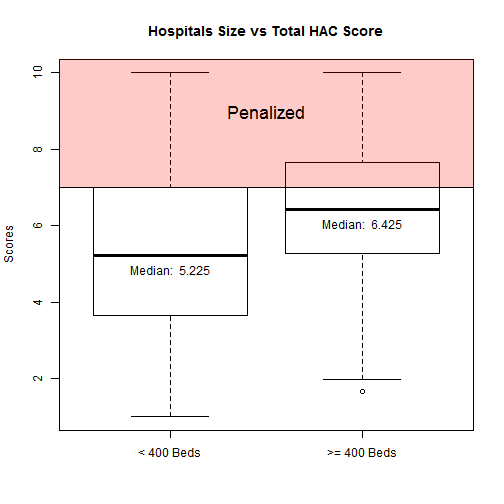

Analyzing HAC Reduction Penalty Likelihood
========================================================


As an addition to the hospital readmissions reduction program (HRRP) and the value-based purchasing program (VBP), the third of the Affordable Care Act's quality incentive programs, the hospital acquired-condition (HAC) reduction program, is set to go into effect beginning in FY 2015. This program aims to incentivize the reduction of costly and often fatal harm events, estimated to cause 99,000 deaths and add as much as $33 billion to the nation's healthcare costs annually(Centers for Disease Control, 2009).  

Many, most prominantly the American Hospital Association (AHA), have raised concerns that the program's penalties will affect teaching hospitals and hospitals at or over 400 beds disproportionately. The Essential Hospitals Institute is interested in determining the effect of this program on the members of America's Essential Hospitals specifically and, more generally, those hospitals that have made it their mission to care for the nations' vulnerable populations.

We begin by investigating the concerns raised by the American Hospital Association (AHA) using CMS' own predictions recently released in the  FY2015 Inpatient Prospective Payment Proposed rule. We then move on to analyze the effect of the program on members of America's Essential Hospitals. Finally we...

## Data
* CMS' FY2015 Inpatient Prospective Payment Proposed rule
* American Hospital Association's Annual Survey of Members

## Results
Recently released preliminary data from CMS' FY2015 Inpatient Prospective Payment Proposed rule estimates that 772 hospitals will be penalized under the program with a one percent reduction in hospital payments from the Centers for Medicare & Medicaid Services. By merging this preliminary IPPS data with the data gathered as part of the AHA annual survey of members, we were able to examine the expected penalties under the program by both size and teaching status.

 This estimation shows that
38.12 percent of hospitals with 400 beds or more will be penalized. Teaching status, defined in our analysis as being a member of the Council of Teaching Hospitals, faced penalties at a rate of 54.47 percent.

A chi-square test of independence was performed to examine the relation between a hospital size of 400 beds or greater and penalties under the HAC reduction program. The relation between these variables was significant, X2(1, N = 3263) = 68.17, p <.001. Larger hospitals were more likely to be penalized under the program. 

A similar chi-square test examining the relationship between teaching status and penalties also returned significant results, X2(1, N = 3263) = 150.10, p <.001, indicating that teaching hospitals were also more likely to be penalized under the program.


   


```
##    
##        0    1
##   0 1955  488
##   1  565  255
```

```
## [[1]]
## [1] "Odds ratio between the level [ 0 ] of the first variable and the level [ 0 ] of the second variable:"
## 
## [[2]]
##   LowerCI    OR UpperCI alpha
## 1   1.513 1.808    2.16  0.05
```


## Discussion


## Summary
